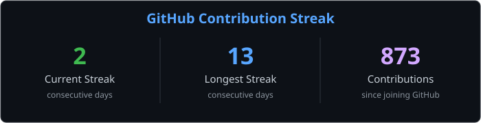

  

  <a href="https://aaditmehta.dev"><strong>Portfolio</strong></a>
  &nbsp;•&nbsp;
  <a href="https://aaditmehta.dev/resume"><strong>Resume</strong></a>
  &nbsp;•&nbsp;
  <a href="https://pick44.com"><strong>Pick44</strong></a>

## Hey, I'm Aadit 👋

I'm a full-stack AI builder in the Bay Area. I like taking ambitious ideas from a blank repo to a real, usable product across web, mobile, and AI.

- Software engineer at **Venu AI (YC W21)**, shipping product and authentication experiences
- Founder of **[Pick44](https://pick44.com)**, helping companies understand how AI models discover and recommend products
- Most interested in **AI agents, human-in-the-loop systems, developer tools, and mobile products**
- Usually building with **TypeScript, Python, Swift, React, React Native, Next.js, Supabase, and Firebase**

## Selected builds

| Project | What I built | Stack |
| --- | --- | --- |
| **[Verifi](https://github.com/aaditmehtacoder/cwb-verifi)** | School emergency accountability where AI suggests where to look, but a human always confirms the truth. | Expo, React Native, Supabase, OpenRouter |
| **[OpenRubric](https://github.com/aaditmehtacoder/openrubric)** | Managed judging infrastructure for hackathons, from Devpost import and weighted rubrics to live scoring and winner review. | Next.js, TypeScript, Supabase, GitHub API |
| **[Loop](https://github.com/aaditmehtacoder/sproutbyloop)** | An iOS app that makes you earn distracting-app time through real habits, then reliably re-blocks apps when the window ends. | SwiftUI, Screen Time APIs, CoreHaptics |
| **[Beacon5](https://github.com/aaditmehtacoder/beacon5)** | A first-place campus safety app with emergency beacons, live location, guardian alerts, and background tracking. | Expo, React Native, Firebase, Maps |

## Toolbox

  

## Building in public

  

  
  

  <strong>I care about products that are technically ambitious, visually thoughtful, and useful in the real world.</strong>

  <a href="https://aaditmehta.dev">See what I'm building →</a>

