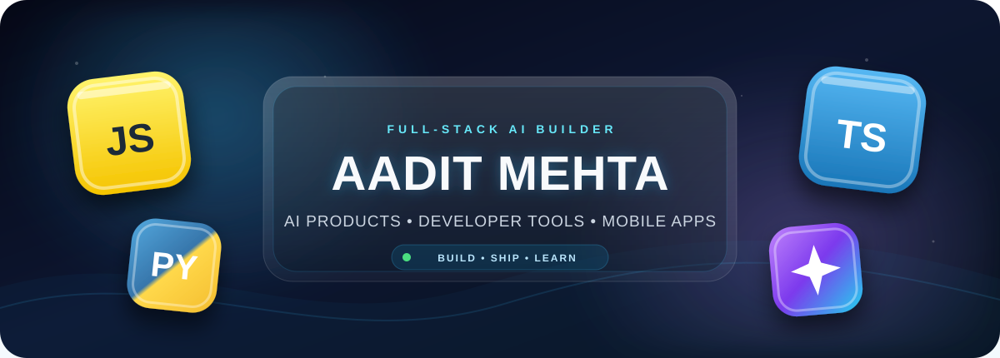
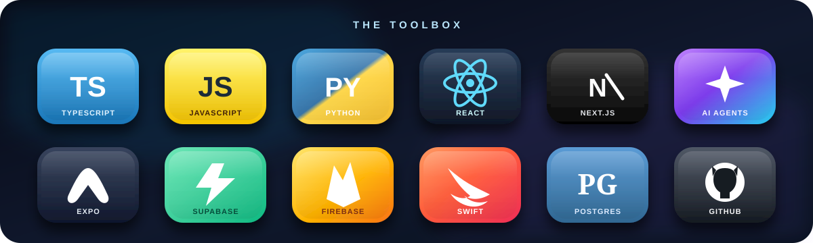

<div align="center">



<br />

<a href="https://git.io/typing-svg">
  
</a>

<p>
  <a href="https://aaditmehta.dev"></a>
  <a href="https://www.pick44.com"></a>
  <a href="https://openrubric.vercel.app"></a>
  <a href="mailto:aaditmehtacoder@gmail.com"></a>
</p>

<p>
  
  
  
  
</p>

</div>

## `> whoami`

```text
Aadit Mehta
Full-stack AI developer, product builder, and software engineering intern
Based in Santa Clara, California

I like taking ambitious ideas from a blank screen to a product people can actually use.
My work spans AI agents, developer tools, web platforms, mobile apps, and automation.
```

## Impact at a Glance

<div align="center">


</div>

## Currently Shipping

<table>
<tr>
<td width="50%" valign="top">

### Pick44

**Search Console for AI answers.** Pick44 measures how ChatGPT, Claude, Gemini, Perplexity, and AI Overviews describe, rank, cite, and recommend brands against competitors.

`AI visibility` `GEO` `analytics` `recommendations`

[](https://www.pick44.com)

</td>
<td width="50%" valign="top">

### OpenRubric

**Transparent judging infrastructure.** Import submissions, coordinate judges, inspect GitHub timelines, score projects live, and publish verifiable winners.

`open source` `hackathons` `live scoring` `GitHub`

[](https://openrubric.vercel.app)
[](https://github.com/aaditmehtacoder/openrubric)

</td>
</tr>
<tr>
<td width="50%" valign="top">

### Venu AI

**Software Engineering Intern.** I ship full-stack product features, GitHub automation, email workflows, and AI-powered developer tooling across Django, React, PostgreSQL, Redis, and Celery.

`full stack` `automation` `production systems`

[](https://www.venu3d.com/)

</td>
<td width="50%" valign="top">

### Mobile and Hackathon Builds

I shipped **BoreNoMore** on the Apple App Store and built **Beacon5**, a first-place project at Synthesis Hacks hosted at Google.

`Swift` `iOS` `rapid prototyping` `shipping`

[](https://apps.apple.com/us/app/borenomore/id6749814755)
[](https://github.com/aaditmehtacoder/beacon5)

</td>
</tr>
</table>

## My 3D Toolbox

<div align="center">
  
</div>

<br />

**Languages:** TypeScript, JavaScript, Python, Swift, Luau, SQL  
**Frontend:** Next.js, React, React Native, Expo, Tailwind CSS, shadcn/ui  
**Backend and Data:** Node.js, Django, Supabase, Firebase, PostgreSQL, Redis, REST APIs  
**AI:** LLM APIs, agents, evaluation pipelines, prompt orchestration, Groq, Cerebras, Qwen  
**Infrastructure:** GitHub Actions, GitHub Apps, Vercel, Render, Celery, Git, Xcode, Figma

## Selected Builds

| Project | What it does | Proof of work |
|---|---|---|
| **Pick44** | Tracks brand visibility and competitive positioning across AI answer engines. | Working product and paying customers |
| **OpenRubric** | Gives competitions shared rubrics, live judging, GitHub review, and transparent results. | Open source and built for real hackathons |
| **Beacon5** | A high-speed hackathon product built around a meaningful real-world problem. | 1st place at Synthesis Hacks at Google |
| **BoreNoMore** | A native iOS product designed, built, and shipped publicly. | Live on the Apple App Store |
| **CallZI** | An AI voice receptionist that answers calls and helps businesses capture leads. | Product and landing experience shipped |
| **Loquat4Humanity** | A youth-led platform supporting NICU fundraising and community impact. | Real-world social impact initiative |

## GitHub Activity

<div align="center">
  
</div>

<div align="center">
  
</div>

<div align="center">
  
  
</div>

<div align="center">
  
</div>

## Build Log

```yaml
building:
  - Pick44
  - OpenRubric
  - production AI products

learning:
  - PyTorch and model training
  - Swift and native mobile engineering
  - evaluation systems for LLMs and agents
  - scalable production architecture

exploring:
  - AI developer tools
  - voice agents
  - healthcare and safety applications
  - better ways for small teams to ship faster

open_to:
  - high-impact engineering projects
  - internships
  - hackathons
  - ambitious collaborators
```

## Beyond Code

- Learning how to fly a **Cessna 172**.
- Following the **San Jose Sharks, Golden State Warriors, San Francisco Giants, San Jose Earthquakes, and San Francisco 49ers**.
- Building at hackathons because deadlines force clear thinking, fast decisions, and real shipping.

## Let’s Build Something Useful

<div align="center">

I enjoy working with founders, engineers, hackathon organizers, and ambitious teams building technology that matters.

[](https://aaditmehta.dev)
[](mailto:aaditmehtacoder@gmail.com)
[](https://github.com/aaditmehtacoder)

<br />

### Build fast. Learn constantly. Ship things that matter.


</div>
